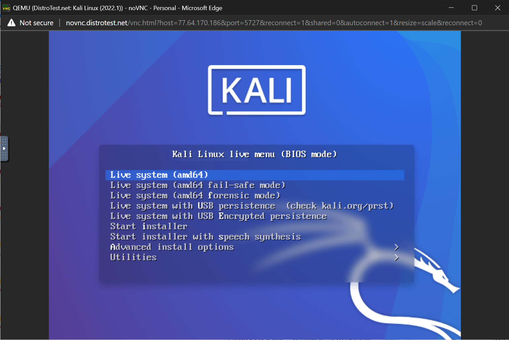
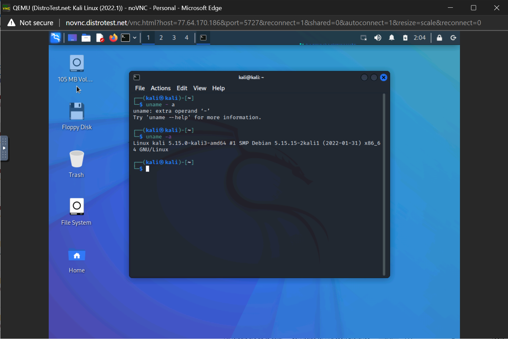
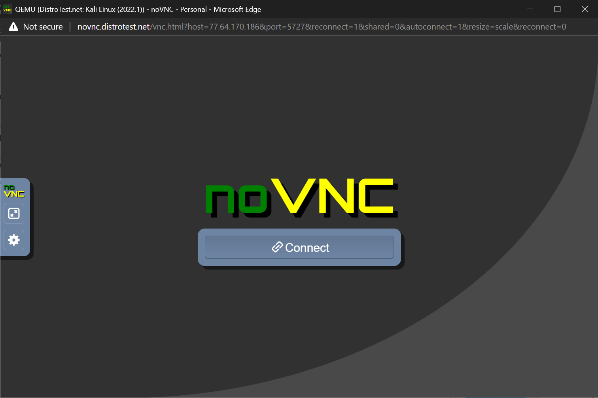

# Lab 1 Exploring Linux distributions

## Question 1
1. What is the OS Type: **Linux**
2. Which major distro is it based on? **Debian**
3. Which processor architecture does it support? **armh, ppc64el, riscv, s390x, x86_64**
4. Is the distribution active or is it discontinued? **Active**
5. What is the distro’s home page? **https://www.ubuntu.com/**

## Question 2
1. What is the name of the distribution and the OS Type: 
   - Name: **Miracle Linux**
   - OS Type: **Linux**
2. Which major distro is it based on? **Red Hat**
3. Which processor architecture does it support? **x86_64**
4. Is the distribution active or is it discontinued? **Active**
5. What is the distro’s home page? **https://www.miraclelinux.com**

## Question 3
1. What is the name of the distribution **Neptune**
2. what is the country of Origin? **Germany**
3. What major distribution is it based on **Debian (Stable)**
4. What is the distribution Category? **Desktop, Live Medium**
5. Which processor architecture, aside from the one in the original query, does the os support? **Only x86_64**

## Question 4
#### A Linux distribution used for Date rescue/ Date recovery 
|   Distro name   |     Website                  |     Desktop Environment |
|-----------------|------------------------------|-------------------------|
|   SystemRescue  | http://www.system-rescue.org |          Xfce           |
### A Linux distribution used for Education that supports the ix86 processor architecture.
| Distro name |       Website       |                    Desktop Environment                                         |
|-------------|---------------------|--------------------------------------------------------------------------------|
|    NixOS    |  http://nixos.org/  |  Awesome, Eligtenment, Fluxbox, GNOME, i3, IceWM, KDE Plasma, Ratpoison, Xfce  |

### A Linux distribution that supports the OEM installation method
| Distro name | Website                 | Desktop Environment   |
|-------------|-------------------------|-----------------------|
| Linux Mint  | https://linuxmint.com/  | Cinnamon, MATE, Xfce  |

## Question 5

## Question 6

