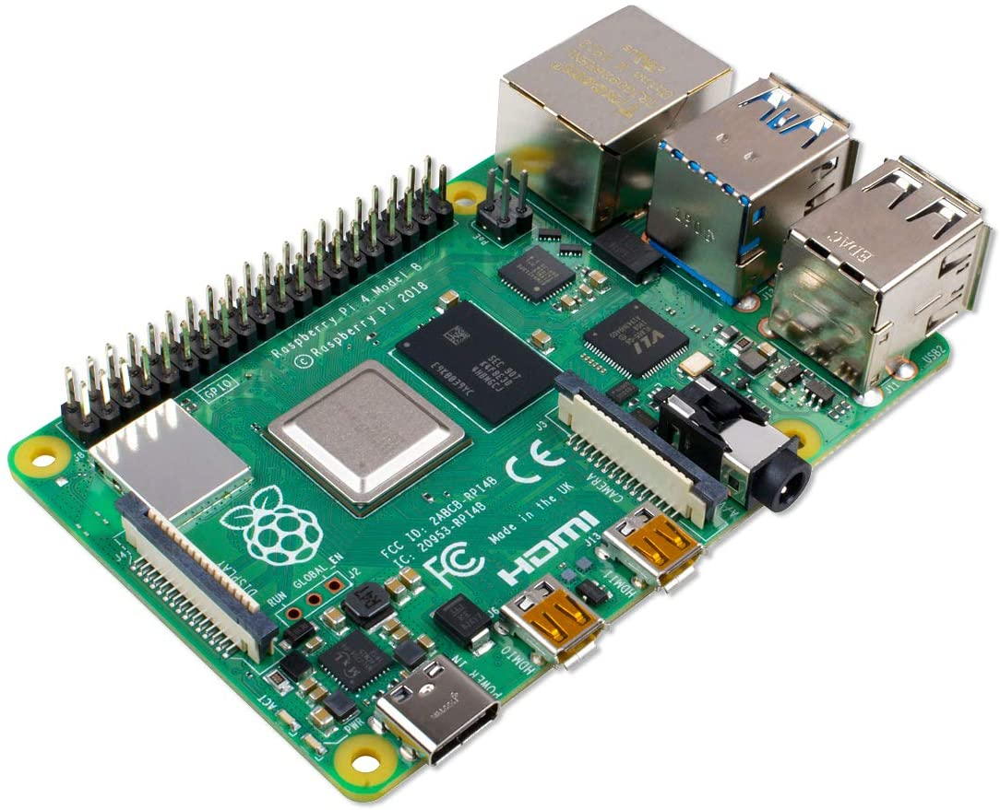
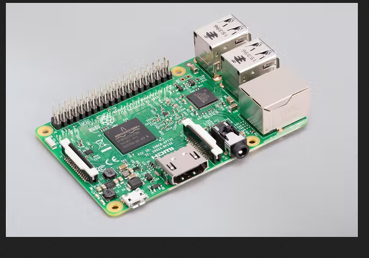
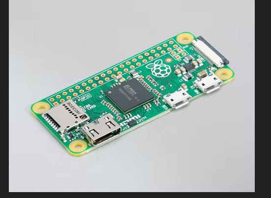

# Week Report 2

## Summary of Presentation 
Virtualization:
What is virtualization? Virtualization is hardware to simulate a virtual machine inside a physical machine. There are different types of virtualization such as running on the hardware or running on a host operating system. Also, they are benefits of virtualization and they are allowing multiple OS on one machine and it also can allow application to be tested before installing them on a host machine. 

Screenshots:

Raspberry Pi:
What is a raspberry pi? 
Raspberry pi is a small computer that plugs into a computer monitor or tv, and uses basic output like keyboard and mouse. However it is capable of doing everything like a normal computer.
Different models:
- Raspberry Pi 4:

- Raspberry Pi 3:

- Raspberry Pi Zero:

Well there are many projects you are able to do even for beginners such as:
1. Meeting indicator 
2. Speech recognition
3. Building a hacking machine
4. Wifi Extender
Well lastly personally I find it very interesting is 
5. crypto tracker 