# Lab 4: The Linux Filesystem 

## Question 1

| Command | What it does | Syntax | Example |
|---------|--------------|--------|---------|
|     Bin | Essential Commands   |` / ` + `bin`|`/bin `|
|   dev   | device Files  |` / ` + `dev` |` /dev`|
|   etc   | System configuration Files |`/ ` + `etc`|`/etc/ `|
|   home  | User home directories |`/` + `home`+ `name of the user` |`/home/flores`|
| media   | Mount point for removable media, such as DVDs and floppy disk  |`/` +`media` + `/` + `name of user` + `either flash drive or external drive`|`/media/flores/flashdrive`|
|    opt  |  Add-on software packages   |` /` + `opt` + `name of software `|`/opt/google/chrome`|
|  proc   | kernel information process control, system hardware information  |` /`+ `proc`|` /proc `|
| srv     | Infformation relating to services that run on the system |` / ` + `srv` |`/ srv       `|
| usr     | Software not essential for system operation, such as applications |`/` +  ` usr ` + `/` + `share`+ `name of application`|`/usr/share/font/ `|

## Question 2
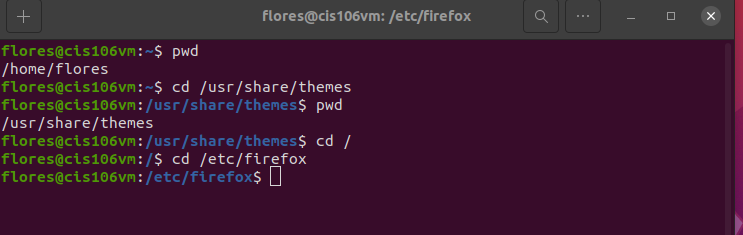
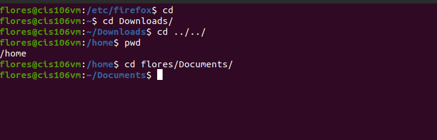

## Question 3
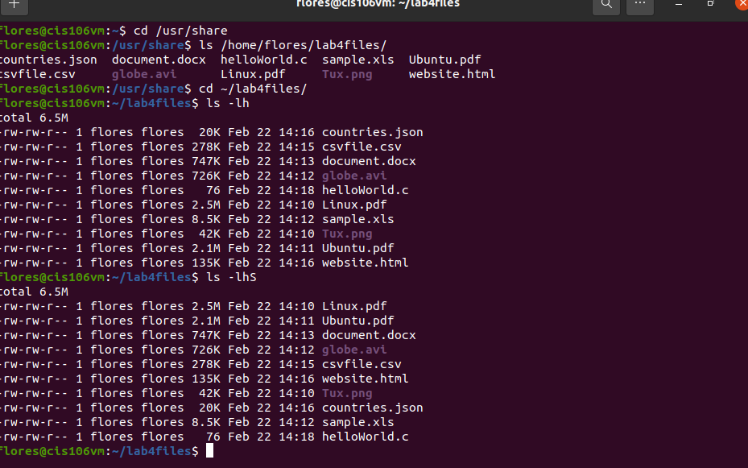
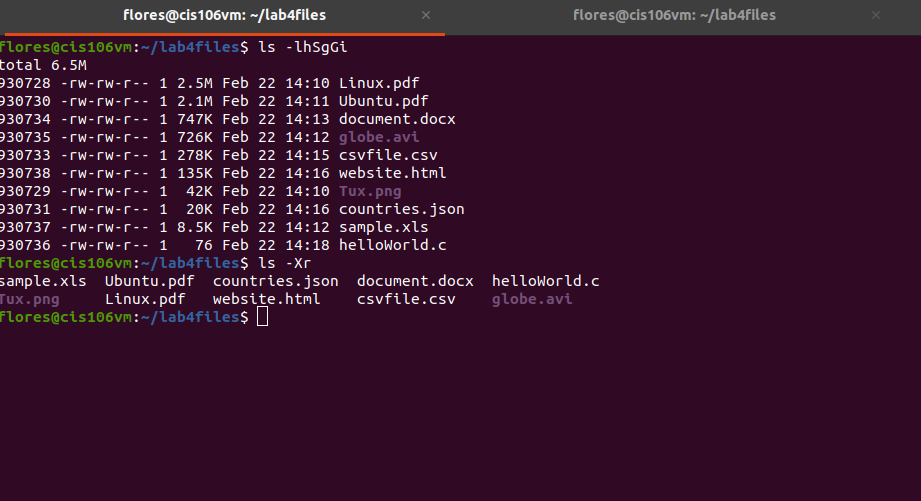

## Question 4
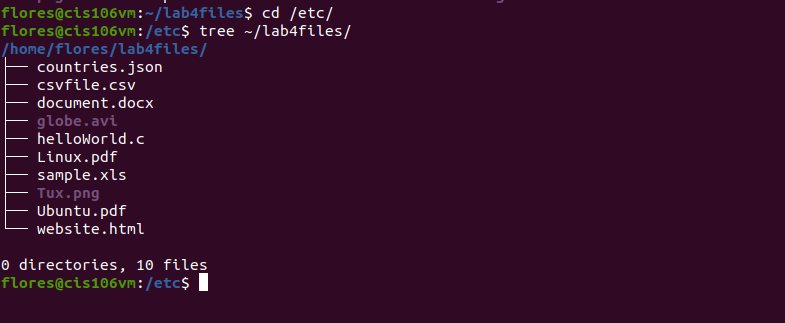
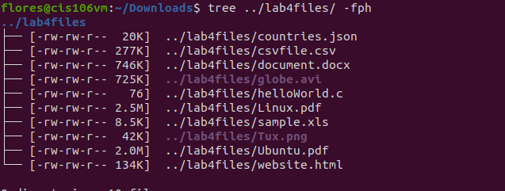
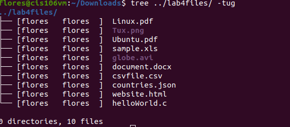
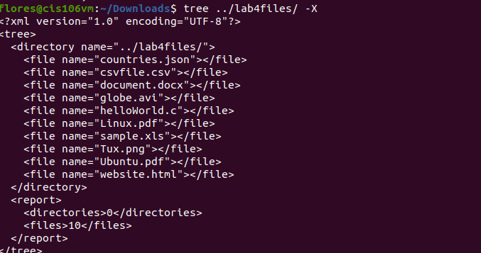
![question 4.5](q4.5.png

## Question 5 
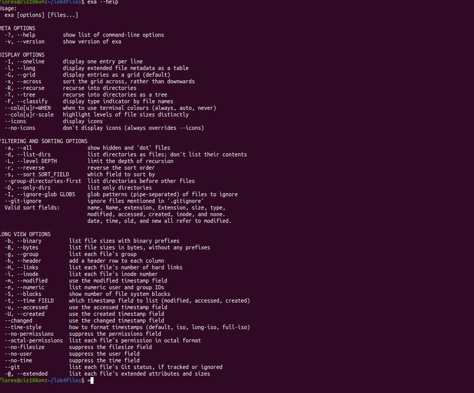
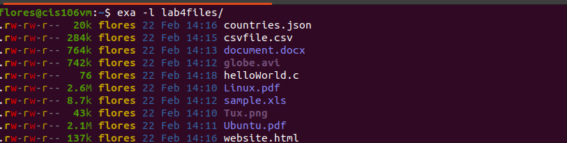
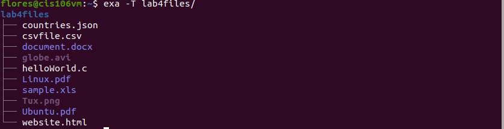
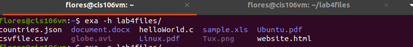

