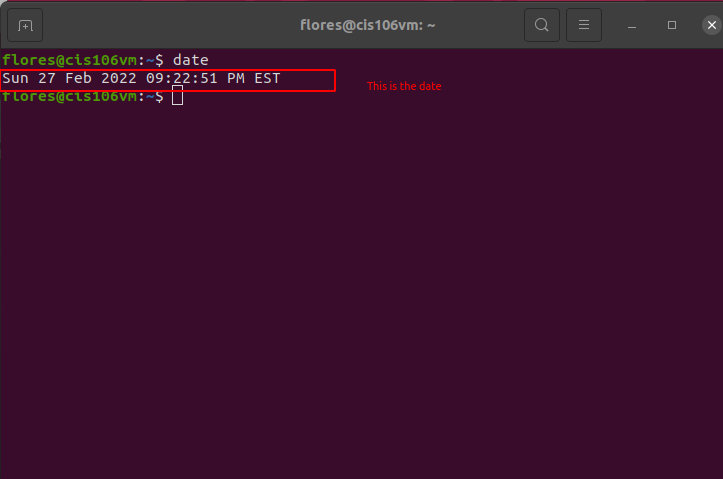
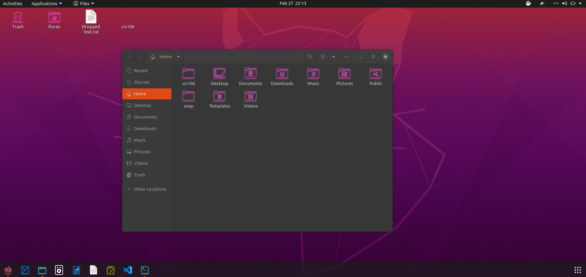

# Lab 3 using Ubuntu 

# Question 1
## Date

## shortcut

# Question 2

# Question 3 
| Program purpose     | Package Name |      Version       | Description |
| ------------------- | ------------ | ------------------ | ----------- |
| Play a tetris game  | blockout2    | 2.5+dfsg1-1build1  | Tetris like game (3D0 tetris) |
| Play a video file   | deepin-movie | 5.0.0-1build1      | Deepin movie player |
| Browse the internet |    firefox   | 97.0+build2-0ubuntu0.20.04.1  | web browser  |
| Read your email     | xbuffy       | 3.3.bl.3.dfsg-10build1 | monitor mailboxes and/or newsgroups|
| Play music          |  knowthelist |  2.3.1-1build1     | awesome party music player    |

commands Answers:
- Sub question 1: `sudo apt install blockout2 deepinmovie firefox xbuffy knowthelist`
- Sub question 2: `sudo apt remove blockout2 deepin-movie firefox xbuffy knowthelist `
- Sub question 3: `sudo apt install blockout2+ deepin-movie+ firefox- xbuffy- knowthelist-`

# Question 4
| command | what it does |
|---------|--------------|
| echo    | display a line of text |
| fortune | print a random, hopefully interesting, adage |
| cowsay  | configurable speaking/thinking cow (and a bit more) |
| lolcat  | rainbow coloring for text  |
| figlet  | large text out of the command |
| toilet  | display large colorful characters  |
| rig     | random Indetity generator |