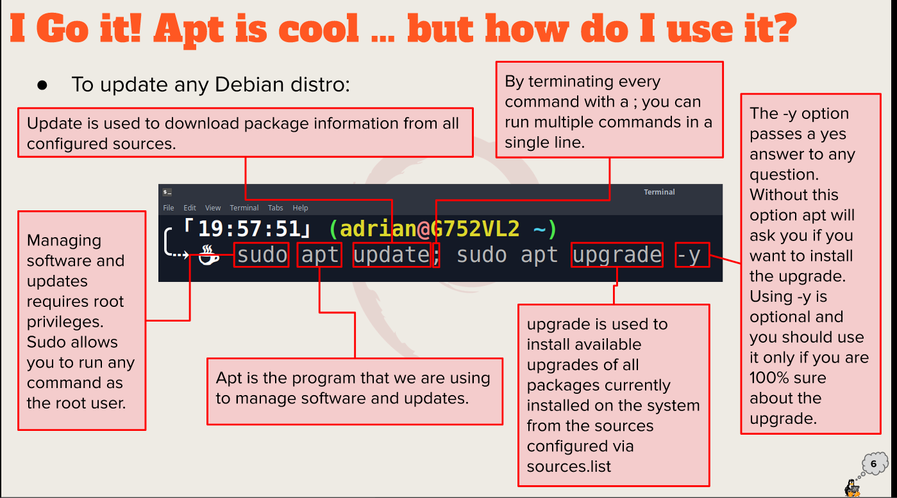

# Week 3 Report 

## Summary of Presentations 

### Exploring desktop Environments 
- a. List of Different Desktop Environments:
  - 1. GNOME
  - 2. DE
  - 3. Xfce
  - 4. LXQt
  - 5. Cinnamon
- b. Definitions:
  - GUI:A graphical user interface. It allows user to interact with the computer 
  - DE: A desktop Environment 
- c. List of Common Elements of a desktop environment
  - 1. Menu
  - 2. Icons 
  - 3. Widgets 
  - 4. Dashboards
  - 5. Launcher 

### The Bash Shell
- a. What is shell:
  - A shell provides you with an interface to the Unix system 
- b. List different shells:
  - 1. The Bourne Shell
  - 2. The C Shell
  - 3. The Korn Shell
  - 4. The Z Shell
  - 5. The power Shell
- c. List some bash shortcuts
  - 1. crt + A : Move to the star of the command line 
  - 2. Ctrl + F : Move one character forward
  - 3. ctrl + L : Clears the terminal screen
  - 4. tab: Auto completes the command or file/directory name
- d. Basic Commands & Usage:
  - 1. Echo - Display a line of text
  - 2. fortune - Print a random, hopefully interesting, adage
  - 3. Cowsay - Configurable speaking/thinking cow
  - 4. lolcat - rainbow coloring for text
  - 5. figlet - large text out of the command   

### Managing Software
- a. Command for updating ubuntu:
  -  `sudo apt update; sudo apt upgrade -y`
- b. Command for installing software:
  - `sudo apt install "Name of the software" -y `
- c. Command for removing software:
  - `sudo apt remove "Name of the software" -y`
- d. command for searching for software
  - `apt search "name of the software"`
- e. Definition of the following terms:
  - **Package**: Archives that contain binaries of software, configuration files and information about dependencies 
  - **Library**: Reusable code that can be used by more than one function or program. 
  - **Repository**: A lard collection of software available for download.  
- f. Screenshot:
  - 

